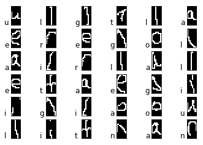

# Handwritten Letters Recognition with Neural Network
**Author:** Stephen Tse \<***@cmu.edu\>

This project trains a a single-hidden-layer neural network for handwritten letter recognition from Optical Character Recognition (OCR) scans. It has a sigmoid activation function for the hidden layer, and a softmax on the output layer, and is implemented following the Module-based Automatic Differentiation (AD) technique.




## Data Assumptions

1. The dataset is a csv file in which the first column be the indices of the actual letter (0: 'a', 1: 'e', 2: 'g', 3: 'i', 4: 'l', 5: 'n', 6: 'o', 7: 'r', 8: 't', 9: 'u'), and the remaining 128 columns be the pixel values that can be reshaped into a 16 x 8 OCR grayscale (even though the given data is binary (B/W), we assume arbitrary values in range [0, 1]) image for each row.

2. The dataset always has the same number of features (128) and same output label space ({0, 1, ..., 9}) for each sample.


## Implementation Notes

1. This implementation does not have any forms of regularization (l1 / l2).

2. The implementation of Stochastic Gradient Descent (SGD) does not shuffle the training data, i.e. it goes through the training dataset in its original order during each iteration. This may not be "stochastic" but it allows producing deterministic results for graders.

3. Learning rate is fixed throughout the training process (set by command flag) for the benefit of the graders.

4. This implementation follows module-based automatic differentiation (AD) convention for easier gradient debugging (faster to locate the layer in which the gradient goes wrong) and easier model mutation in the future.

## Usage

```bash
python neuralnet.py <train input> <validation input> <train out> <validation out> <metrics out> <num epoch> <hidden units> <init flag> <learning rate>
```
1. `<train input>`: path to the training input .csv file
2. `<validation input>`: path to the validation input .csv file
3. `<train out>`: path to output .labels file to which the prediction on the training data should be written
4. `<validation out>`: path to output .labels file to which the prediction on the validation data should be written
5. `<metrics out>`: path of the output .txt file to which metrics such as train and validation error should be written
6. `<num epoch>`: integer specifying the number of times backpropogation loops through all of the training data (e.g., if `<num epoch>` equals 5, then each training example will be used in backpropogation 5 times).
7. `<hidden units>`: positive integer specifying the number of hidden units.
8. `<init flag>`: integer taking value 1 or 2 that specifies whether to use RANDOM or ZERO initialization; that is, if init_flag==1 initialize your weights randomly from a uniform distribution over the range [-0.1,0.1] (i.e. RANDOM), if init_flag==2 initialize all weights to zero (i.e. ZERO). For both settings, always initialize bias terms to zero.
9. `<learning rate>`: float value specifying the learning rate for SGD.


### Example

Input:

```bash
python neuralnet.py largetrain.csv largevalidation.csv model1train_out.labels model1val_out.labels model1metrics_out.txt 2 4 2 0.1
```

3 files are generated in the root directory: model1train_out.labels, model1val_out.labels, and model1metrics_out.txt. The metrics output will report the objective function values (i.e. mean cross entropy) for both the training dataset and the validation dataset in each epoch as well as final model prediction error rates for both the training dataset and the validation dataset.


## Language & Dependencies

**Language:** Python 3.6

**Dependency Requirements:** `numpy` (version 1.14.1)
